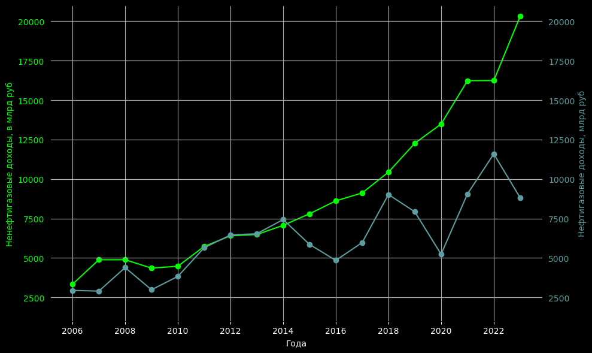
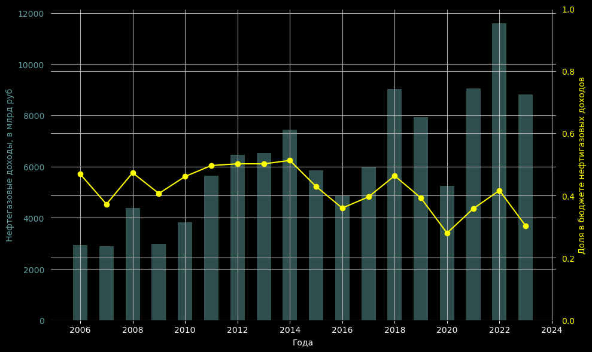
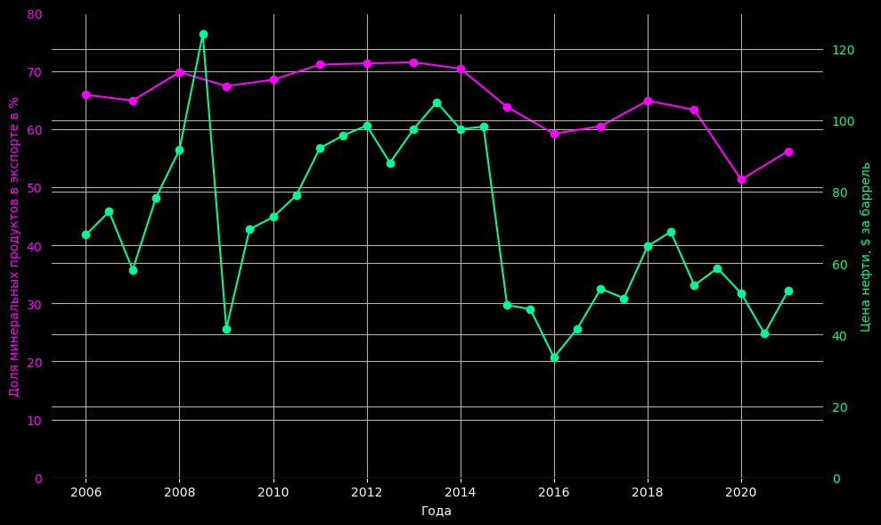
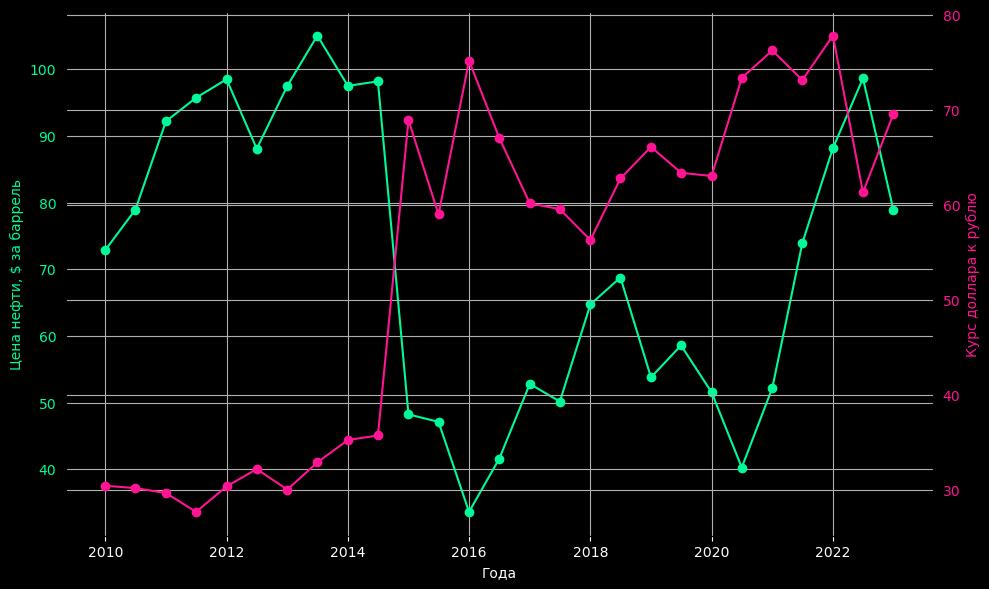
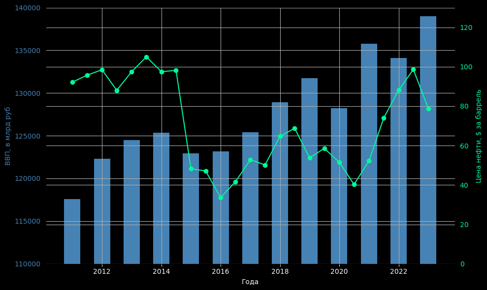

# Тема: Анализ нефтяной зависимости России

**Цель работы:**

Определить степень зависимости экономики России от нефтяной отрасли и оценить, насколько эта зависимость влияет на устойчивость и развитие страны.

**Задачи:**

1. Определить рост как нефтегазовых, так и ненефтегазовых доходов
2. Определить зависимость курса рубля к доллару от цены за баррель
3. Определить зависимость ВВП от цены за баррель

# Описание исходных данных

DF_FEDBUD - доходы федерального бюджета с 2006 по 2023 года. Разделен на нефтегазовые и ненефтегазовые доходы

DF_OIL_PRICE - цена нефти, $ за баррель на начало января/июля

DF_USD_RUB - курс рубля к доллару на начало января/июля

DATA_99STRU - экспорт всех товаров России с 2006 по 2021 года.

DF_GDP - ВВП России с 2011 по 2023 года в млрд руб, в ценах за 2021 год

Все данные были получены из следующих сайтов: https://minfin.gov.ru/, https://rosstat.gov.ru/, https://www.cbr.ru/

# Анализ

Ненефтигазовые доходы почти все время росли в не зависимости от кризисов, нет выраженных падений. Можно только выделить падение доходов после кризиса 2008 года и стагнацию в росте в 2011-2014 годах. В последующие годы доходы от ненефтигазового сектора постоянно росли. Это свидетельствует о стремлении к диверсификации экономики и созданию более устойчивых источников дохода.

Видно, что доля нефтегазовых доходов практически не изменилась, при этом сами доходы кратно выросли. Также можно заметить, что доходы в 2015 году даже выросли, несмотря на санкции и падение цены на нефть. В целом, нефтегазовые доходы составляют ~30% всех доходов бюджета, что говорит о зависимости экономики от цен на нефть. Интересно, что курс доллара к рублю упал в 2 раза после 2015 года, а доходы в свою очередь нет. Чтобы понять этот феномен надо проанализировать как менялись курс рубля к доллару и цены за баррель.

Курс валюты зависит от импорта и экспорта, значит, если экспорт в основном состоит из одного товара, то и курс валюты будет зависеть от стоимости этого товара

В росстате нет отдельной статистики о доли нефти в экспорте. Однако в понятие минаральных продуктов также входит и нефть. Среднее значение доли экспорта минеральных продуктов составляет примерно 64%. В целом, доля минеральных продуктов в экспорте снизилась, но при этом видна зависимость доли экспорта от цены на нефть.

Продажа нефти происходит в долларах, и если до 2015 года мы продавали баррель нефти по 83 доллара, при курсе доллара в 36 рублей, получая доход в рублях (2988 руб. за баррель), то когда нефть начала стоить 48 долларов за баррель, а доллар под 70 (3360 руб. за баррель) доходы бюджета наоборот выросли за счет падения рубля, тем самым оставив доходы от нефтегазового сектора почти незатронутым, как могло быть. Если бы доллар по прежнему стоил бы 35-40 рублей, то бюджет бы не досчитался еще 2млрд рублей. После кризиса 2014 и до кризиса 2020 года цена за баррель стала колебаться в районе 60 долларов, поэтому рубль упал примерно также в 2 раза, чтобы сохранить доходы и даже увеличить их.

Слабый рубль может поддерживать экспортеров и приносить краткосрочную выгоду бюджету за счет роста доходов от продажи нефти и газа, его долгосрочные последствия для внутреннего рынка и уровня жизни населения, как правило, негативны, так как увеличиваются расходы на импорт, увеличивается инфляция, что приводит к росту цен. Для борьбы с инфляцией повышают ключевую ставку, что приводит к замеделению экономической деятельности в стране. Это было видно при анализе роста ненефтегазовых доходов (стаганация в росте до 2015 года). Но инфляция к 2016 году составила уже 6% годовых, а ключевая ставка около 10%(при изначальной (в 2014) в 17%), что вполне нормально для нашей экономики, поэтому из минусов оставался только импорт, но как протекционистская политика это способствовало росту внутреннего производства

Корреляция курса рубля к цены за баррель

|        | Курс рубля    | Цена за баррель   |
|--------|---------|---------|
| **Курс рубля** | 1.000000 | -0.734402 |
| **Цена за баррель**| -0.734402 | 1.000000  |

Видим отрицателньую корреляцию, это говорит о том, что при росте цены за баррель рубль укрепляется и наоборот. Однако это не противоречит тренду диверсификации экономики в стране, что видно в последние годы

Проанализируем рост ВВП от цены на нефть

Корреляция ВВП и цен на нефть до 2014
|        | ВВП      | Цена за баррель    |
|--------|----------|----------|
| **ВВП**   | 1.000000 | 0.459738 |
| **Цена за баррель** | 0.459738 | 1.000000 |

Корреляция ВВП и цен на нефть после 2014

|        | ВВП      | Цена за баррель    |
|--------|----------|----------|
| **ВВП**   | 1.000000 | 0.413044 |
| **Цена за баррель** | 0.413044 | 1.000000 |

Из корреляции видно, что до 2014 года рост ВВП был более зависим от цен на нефть, чем после 2014. Это говорит о том, при условии увеличения доходов от внутреннего производства, нефтегазовый сектор является важной частью экономики, которая до сих пор, но уже в меньшей степени, влияет на экономические связи внутри страны.

# Вывод

Несмотря на то, что нефтегазовый сектор все еще значителен, другие отрасли становятся более важными для общего экономического роста, это видно из доли экспорта минеральных продуктов, роста ненефтегазовых доходов и их стабильность в кризисные года. Прослеживается тренд диверсификации экономики, также этому процессу поспособствовало ослабление рубля и грамотная политика центробанка.
